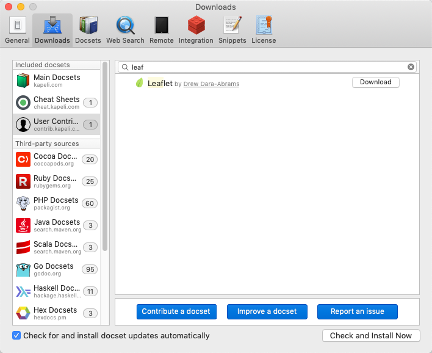

leaflet-docset
==============

Documentation for the [Leaflet](http://leafletjs.com/) JavaScript map library in the Dash [docset](http://kapeli.com/docsets) format, ready for offline reading and searching.

To Use Docs
-----------
1.  Install a docset viewer, like [Dash](http://kapeli.com/dash).
2.  In Dash's preferences, search for this docset under the "user contributed" section:



3. Press "download"

If you are using another docset viewer, like [Zeal](https://zealdocs.org/) for Windows or Linux, you may need to download the docset file (`Leaflet.tgz`) from the latest [release](https://github.com/drewda/leaflet-docset/releases).

To Generate Docs
----------------
The docs are copied from the Leaflet site and indexed using a Ruby script. To set up and run the Ruby script:

````   
   cd leaflet-docset
   bundle install
   rake
   
````

Future Improvements
-------------------
[ ] The [classification of sections](https://github.com/drewda/leaflet-docset/blob/master/Rakefile#L80-110) (into class, method, interface, etc.) is fast and loose. It could use improvement.
